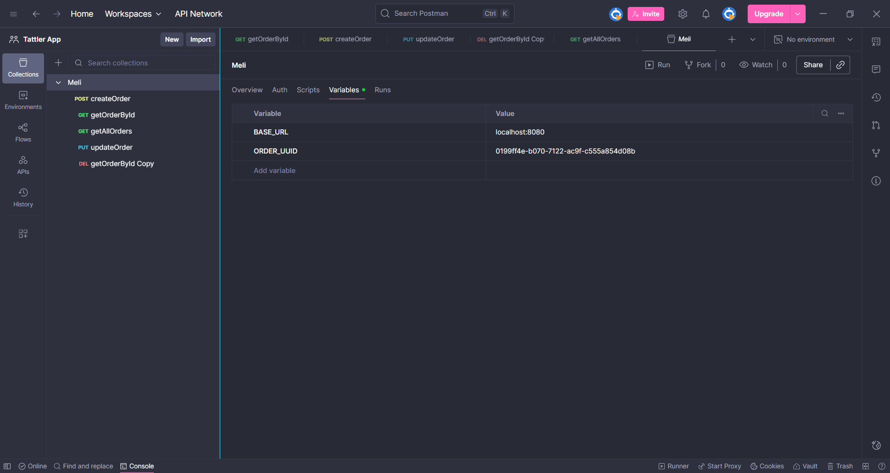
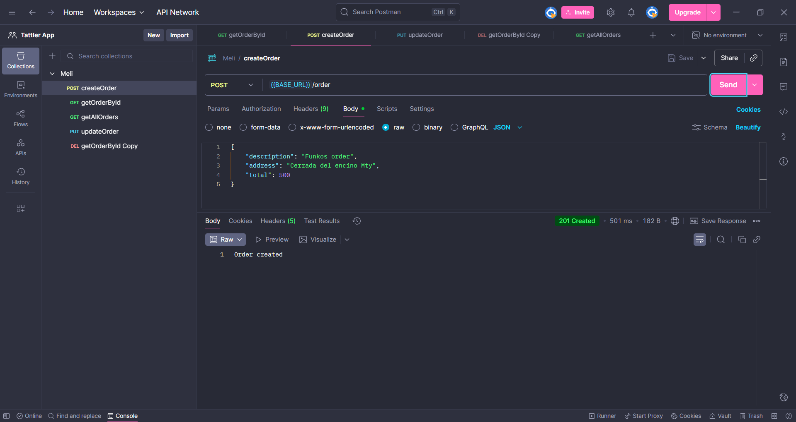
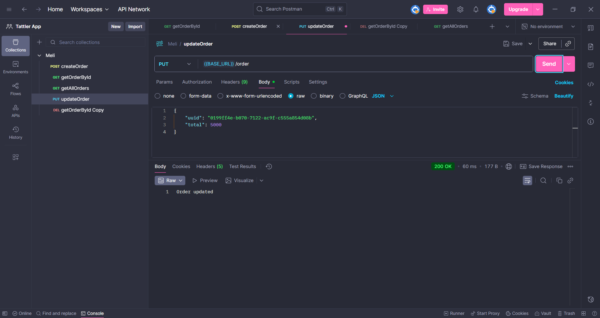
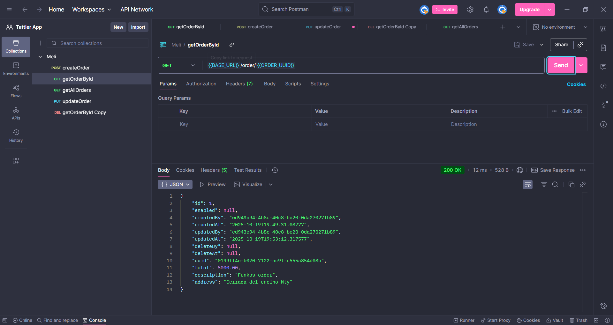
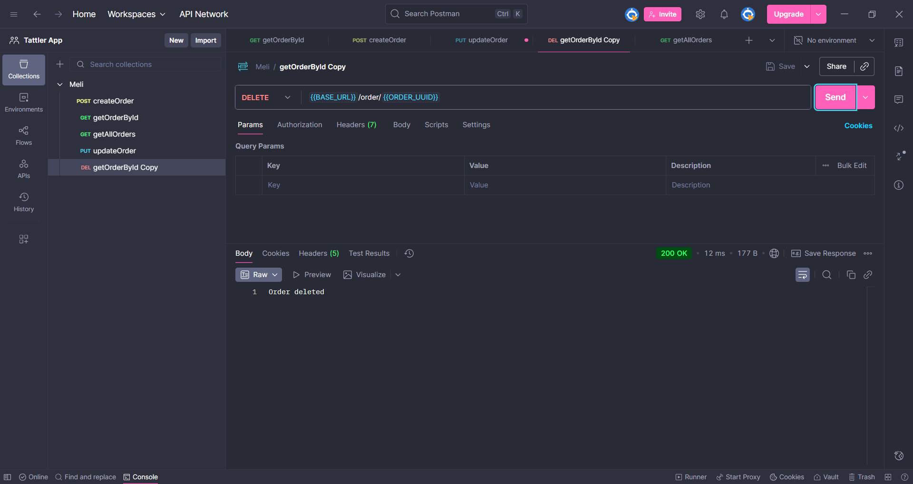
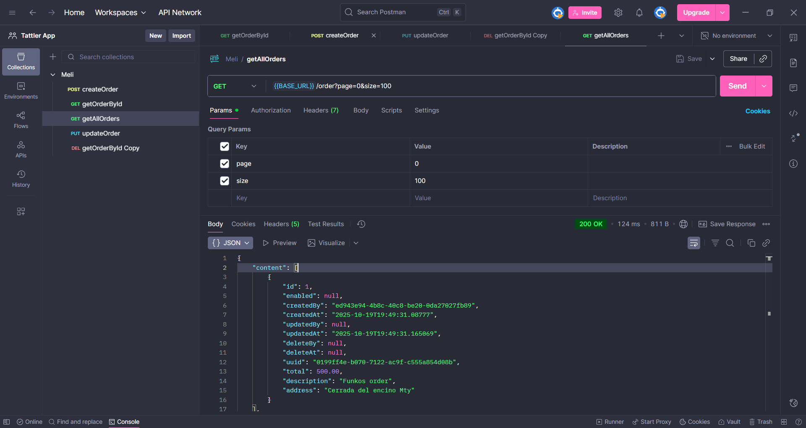

# Postman validation screenshots

This document contains screenshots validating each endpoint in `OrderController.java` using Postman.

## Environment Variables

_Notes:_

- The `baseUrl` variable is set to `http://localhost:8080/order`, which is the root for all order-related API calls.
- An `order_uuid` variable is also defined to store the UUID of a newly created order, making it easy to reuse in subsequent `GET`, `PUT`, and `DELETE` requests.

---

## Endpoints Tested

### 1. Create Order

**POST /order**
_Screenshot:_

_Notes:_

- This screenshot shows a `POST` request to the `{{baseUrl}}` endpoint to create a new order.
- The request body contains a JSON object representing the order details.
- The server responds with `201 Created` and a confirmation message, "Order created", indicating success. The UUID from the created order is then used in subsequent requests.

---

### 2. Update Order

**PUT /order**
_Screenshot:_

_Notes:_

- This screenshot demonstrates updating an existing order via a `PUT` request to `{{baseUrl}}`.
- The request body includes the full order object with modified fields. The `uuid` in the body identifies the order to be updated.
- The server responds with `200 OK` and the message "Order updated".

---

### 3. Get Order by UUID

**GET /order/{uuid}**
_Screenshot:_

_Notes:_

- A `GET` request is made to `{{baseUrl}}/{{order_uuid}}` to retrieve a specific order.
- The `order_uuid` path variable is used to identify the resource.
- The server responds with `200 OK` and the full JSON object of the requested order.

---

### 4. Delete Order

**DELETE /order/{uuid}**
_Screenshot:_

_Notes:_

- This request uses the `DELETE` method on the `{{baseUrl}}/{{order_uuid}}` endpoint to perform a soft delete on the order.
- The server confirms the deletion with a `200 OK` status and the message "Order deleted".

---

### 5. Get All Orders (Paginated)

**GET /order**
_Screenshot:_

_Notes:_

- This shows a `GET` request to the `{{baseUrl}}` endpoint to fetch a list of all orders.
- Query parameters like `page` and `size` can be added to control pagination.
- The server returns a `200 OK` status with a JSON object containing the list of orders and pagination details (`totalPages`, `totalElements`, etc.).

---
